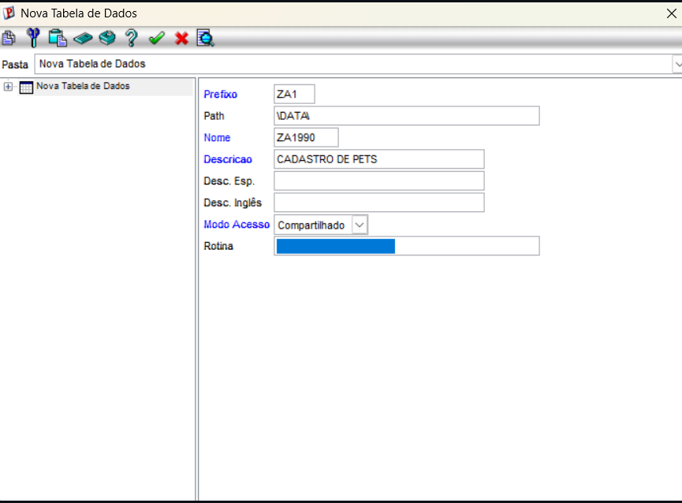
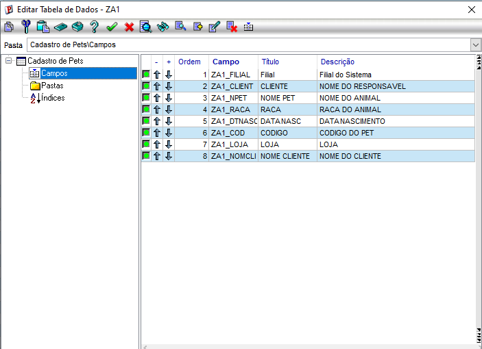
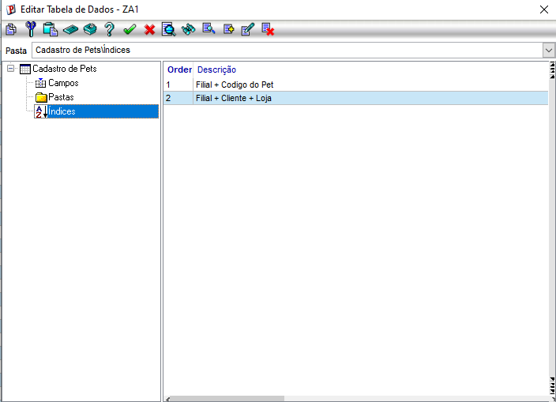

# Exercício 2 — Completando a tabela ZA1 (o pet ganha um dono)

# Etapa 1 — Criação da Tabela (SX2)
Foi criada a tabela ZA1 com as seguintes configurações:

| Campo | Valor |
|--------|--------|
| Prefixo | ZA1 |
| Nome | ZA1990 |
| Descrição | Cadastro de Pets |
| Path | \DATA\ |
| Modo de Acesso | Compartilhado |

# Etapa 2 — Cadastro dos Campos (SX3)

Após criar a tabela, foram cadastrados os seguintes campos:
Estrutura de campos cadastrados para a tabela ZA1:

* **ZA1_FILIAL:** Filial do Sistema
* **ZA1_CLIENT:** Código do Cliente
* **ZA1_LOJA:** Loja do Cliente
* **ZA1_COD:** Código do Pet
* **ZA1_NPET:** Nome do Pet
* **ZA1_RACA:** Raça do Pet
* **ZA1_DTNASC:** Data de Nascimento
* **ZA1_NOMCLI:** Nome do Cliente (Campo Virtual com relação POSICIONE)

# Etapa 3 — Criação dos Índices (SIX)

Foram criados dois índices para facilitar as pesquisas da tabela:

* **Ordem 1:** ZA1_FILIAL + ZA1_COD (Filial + Código do Pet)
* **Ordem 2:** ZA1_FILIAL + ZA1_CLIENT + ZA1_LOJA (Filial + Cliente + Loja)

